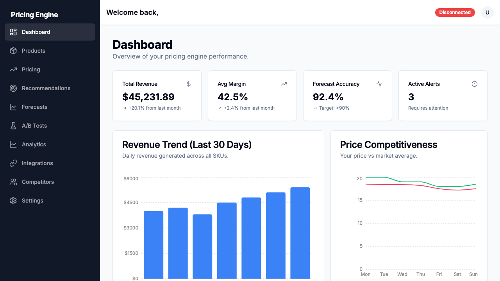
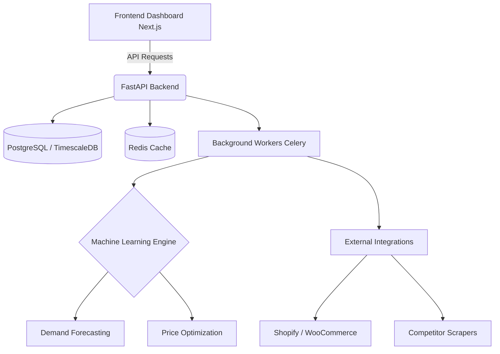
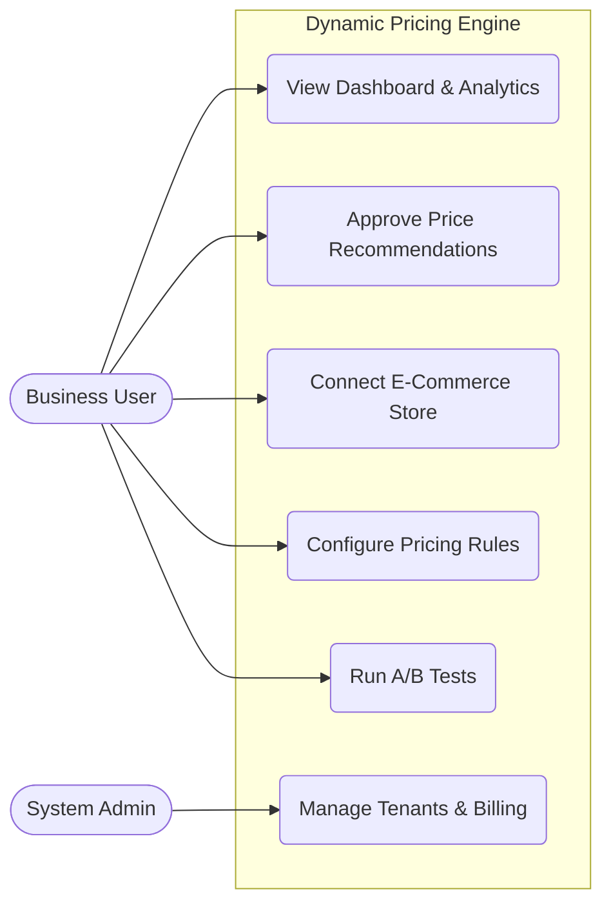
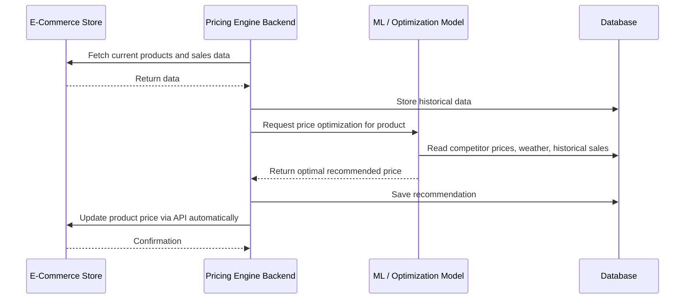

# AI-Powered Dynamic Pricing Engine

Welcome to the **AI-Powered Dynamic Pricing Engine**! 

This project is a smart, automated platform designed to help businesses figure out the best prices for their products in real time. Instead of guessing how much to charge, this system uses data (like competitor prices, weather, demand, and historical sales) to recommend the optimal price that maximizes both sales and profits. 

It is designed to be a complete software-as-a-service (SaaS) application, meaning multiple companies can use it securely at the same time (multi-tenant), and it integrates directly with stores like Shopify or WooCommerce to update prices automatically.

## Application Preview



This view provides an overview of the pricing engine dashboard, displaying real-time revenue trends, price competitiveness, AI-driven recommendations, and actionable alerts.

## Project Details

The system consists of a robust backend that handles the heavy lifting of data analysis, predictions, and automated price adjustments, alongside a modern frontend dashboard where users can see their analytics, approve price changes, and manage integrations. 

Key features include:
1. **Demand Forecasting:** Predicts future sales based on past data and trends.
2. **Competitor Tracking:** Keeps an eye on what others are charging for similar products.
3. **Dynamic Optimization:** Calculates the exact best price for any given moment.
4. **Automated Integrations:** Connects straight to your online store to apply price changes.
5. **A/B Testing:** Safely tests different pricing strategies to see what actually works best.

## Tech Stack Used

- **Frontend:** Next.js (React), Tailwind CSS, TypeScript
- **Backend:** Python, FastAPI, SQLAlchemy (ORM)
- **Database:** PostgreSQL (with TimescaleDB for time-series data)
- **Caching & Tasks:** Redis, Celery worker queue
- **Machine Learning / Analytics:** Scikit-Learn, Prophet, Pandas
- **Infrastructure & Monitoring:** Docker, GitHub Actions (CI/CD), Prometheus, Grafana

## Architecture Diagram



## Use Case Diagram



## Process Flow Diagram



## How to Download and Run

### Prerequisites
Before you start, make sure you have the following installed on your computer:
1. **Git:** To download the code.
2. **Docker Desktop:** To run the application easily without installing all the databases manually.

### Step-by-Step Setup

1. **Clone the repository:**
   Open your terminal or command prompt and run:
   ```bash
   git clone https://github.com/SatyamPandey07/AI-Powered-Dynamic-Pricing-Engine.git
   cd AI-Powered-Dynamic-Pricing-Engine
   ```

2. **Configure Environment Variables:**
   Copy the example environment file so the system knows its internal settings.
   ```bash
   cp .env.example .env
   ```

3. **Start the Application:**
   Run the following command to download all dependencies and start the services. This might take a few minutes the first time.
   ```bash
   docker compose up -d --build
   ```

4. **Access the Application:**
   - **Frontend Dashboard:** Open your web browser and go to `http://localhost:3000`
   - **Backend API Docs:** Open `http://localhost:8000/docs` to see all available API actions.

5. **Stopping the Application:**
   When you are done testing, you can stop everything safely by running:
   ```bash
   docker compose down
   ```